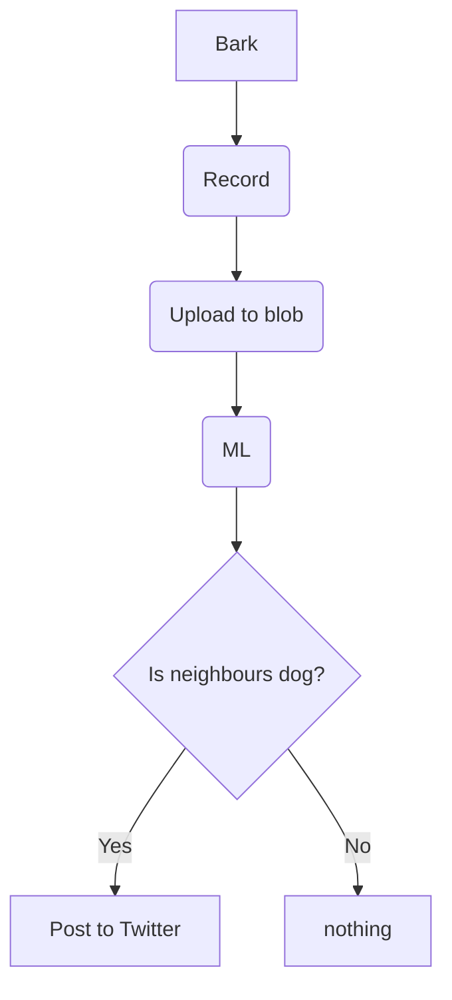

# Project VovVov

## Introduction

My neighbour has a small dachshound and it will bark at anything, everyone and all the time. They get up at 06 every day of the week and let the dog out in the yard where it will bark until it gives up and walks back inside.

I've tried many times to ask them to control the barking but am always met with hostility and back excuses like there was a fox in the garden (but explanation about how the fox got in while at the same time the dachhound is not able to get out.

Anyway - I've given up trying to ask them to silence the dog, so I thought I'd build something that can detect if a dog is barking and then use machine learning to detect if it's my neighbours dog and if so then post the number of barks and time somewhere.

## Overall Solution

So far this is a bit sketchy but I'm imagining something like this:

Recording is probably a Pi which stores the recording in blob store in Azure where a function then kicks off the ML detection with yet another function doing something with the results. Posting to Twitter is an option, but a webpage is probably more useful for this.

Will most likely use Python. This is an evolving architecture.

## Architectural Significant Requirements

I like to as quickly as possible try to determine the requirements which will have a significant impact on the solution design. If you're building a submarine then it has to be water tight or a bridge then it has to be able to span the divide, carry expected load, not collapse and last for a hundred years. These kinds of requirements tend to point the solution design in a certain direction.

So we have the following significant requirements:

* Record when sound above a certain volume (energy) level is detected
* Process recorded sound and recognize if a particular dog is barking
* Optionally count the number of barks - this is out of scope for v1
* Store time and date of barking to a storage system
* Show results on webpage

Let's see where this will go.

## Experimenting with the parts

1. [Recording sound using a Raspberry Pi]{https://github.com/peterbb148/vovvov/blob/main/Record.md}
2. Uploading the recorded sound to Azure Blog Storage
3. Detecting a dog barking in a sound recording using Azure Cognigtion

